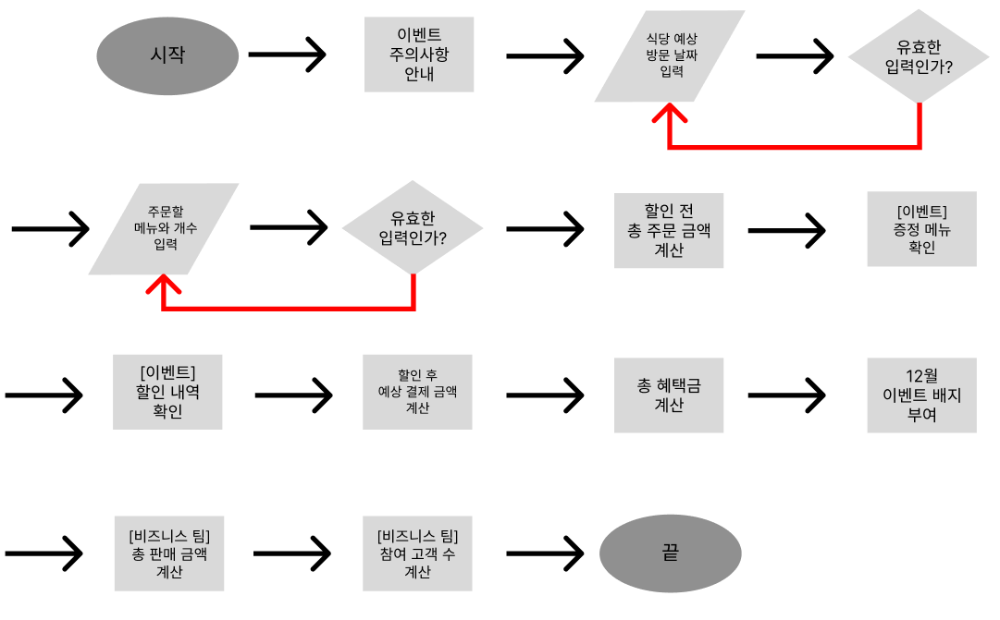

## 프로그래밍 목표

1. **TDD (단위 테스트)**
2. **OOD**
3. 아키텍쳐 패턴 **MVC** 적용
4. **디자인 패턴** 적용

## 기능 구현 목표
### Flow

### 세부 기능
0. 모든 에러는 `[ERROR]`로 시작하며 입력값 에러 발생 시 해당 부분부터 재입력받는다.
1. 이벤트 주의 사항 안내
2. 식당 예상 방문 날짜 입력
3. 유효성 검사
   - 입력값이 숫자가 아닌 경우
   - 입력값이 1이상 31이하가 아닌 경우
4. 주문할 메뉴와 개수 입력
5. 유효성 검사
   - 메뉴가 여러 개일 때,  `,`로 구분되어 입력되지 않은 경우
   - 메뉴와 개수가 `-`로 구분되어 입력되지 않은 경우
   - 메뉴판에 없는 메뉴를 입력하는 경우
   - 메뉴의 개수가 숫자가 아닌 경우
   - 메뉴의 개수가 1 이상이 아닌 경우
   - 중복 메뉴를 입력한 경우
   - 음료만 주문한 경우
   - 주문 메뉴의 총 개수가 20 초과인 경우
6. 할인 전 총 주문 금액 계산
   - 10,000원 미만인 경우 증정 메뉴, 혜택 내역, 총혜택 금액을 계산하지 않는다.
7. 이벤트 확인
   > **증정 메뉴** 확인 - 증정 이벤트
   >
   > **할인 내역** 확인 - 크리스마스 디데이, 평일 or 주말, 특별 이벤트
   >
8. 할인 후 예상 결제 금액 계산
    - 할인 후 금액이 양수인지 확인한다.
9. 총 헤택금 계산
10. 12월 이벤트 배지 부여

## 추가 사항
1. 지난 5년 중 최고의 판매 금액임을 계산하기 위해 **총 판매 금액을 계산**한다.
2. 참여 고객의 5%가 설날 이벤트에 재참여했는지 확인하기 위해 **참여 고객 수를 계산**한다.
3. 위의 1, 2 사항에 따라 **유저**를 구현 항목에 추가한다.
4. 추가 사항은 **비즈니스 팀**을 위한 기능이므로 유저는 이용할 수 없게 분리한다.
5. 위의 4 사항에 따라 프로젝트의 Model은 **싱글톤**으로 설계한다.

## 테스트 목표
1. 식당 예상 방문 날짜
   - [x]  입력값이 숫자인 경우 어떠한 에러도 반환되지 않는다.
   - [x]  입력값이 숫자가 아닌 경우 `IllegalArgumentException`이 반환되며 에러 메시지는 `[ERROR] 유효하지 않은 날짜입니다. 다시 입력해 주세요.`이다.
   - [x]  입력값이 1이상 31이하일 경우 어떠한 에러도 반환되지 않는다.
   - [x]  입력값이 1이상 31이하가 아닐 경우 `IllegalArgumentException`이 반환되며 에러 메시지는 `[ERROR] 유효하지 않은 날짜입니다. 다시 입력해 주세요.`이다.
2. 주문할 메뉴와 메뉴 개수
   - [ ]  